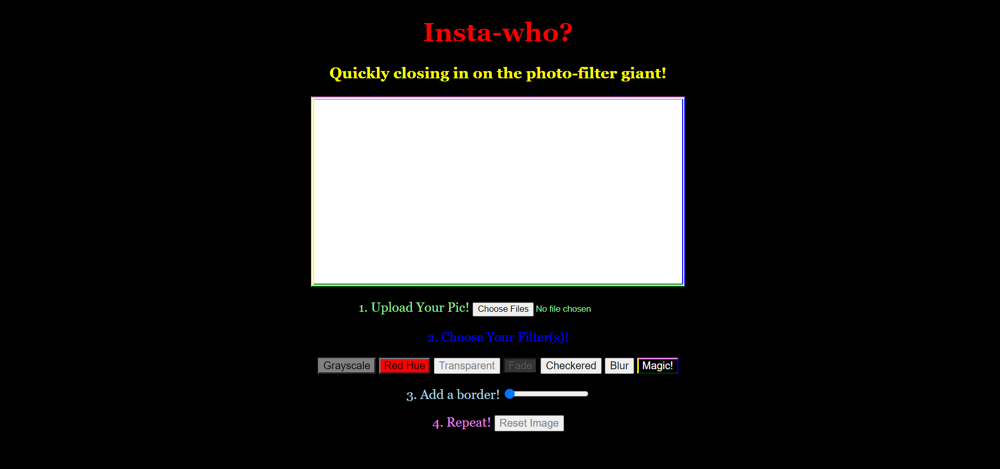
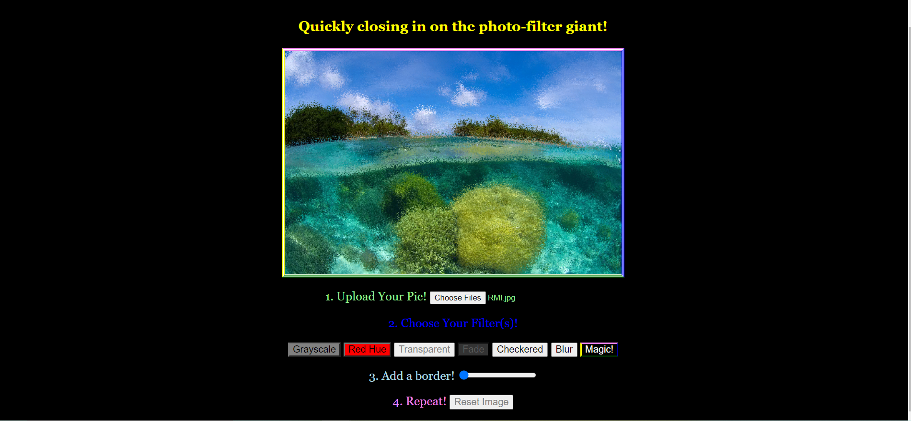
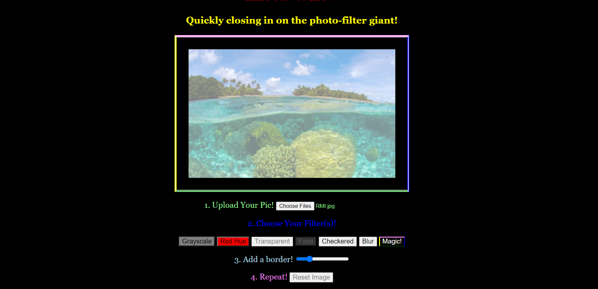
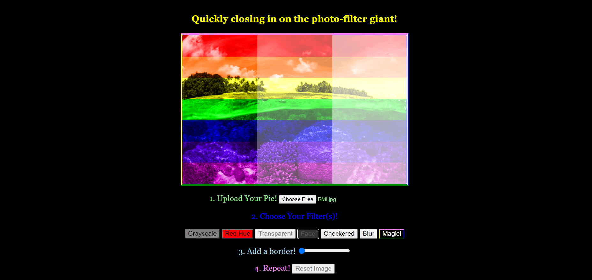
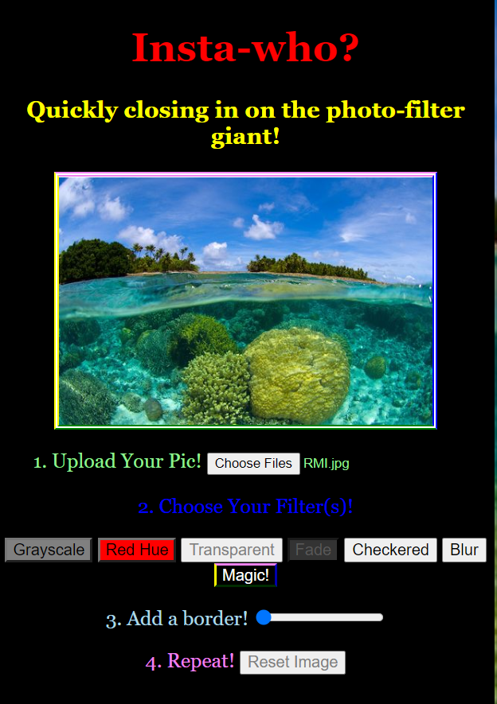

# insta-who
Web page that allows users to upload images and apply unique image filters as well as a border. 
Designed with HTML, CSS, and Javascript. Uses event-handling.

## Home Screen

Details: Options to upload image, apply multiple filters, and a border. Reset image to revert to original.
Event handlers update canvas according to user input.

## Filter

Details: Random pixels are traded with those nearby to create blur.

## Filter & Border

Details: Alpha values are manipulated to cause a more transparent image. Border is adjusted according to user input via slider.

## Multiple Filters

Details: Multiple filters can be applied at the same time. This is "Fade" and "Magic". 
Both of these filters manipulate pixels according to x,y coordinates - Fade modifies alpha values and Magic modifies RGB values.

## Mobile View

Details: Responsive web design resizes according to screen.
